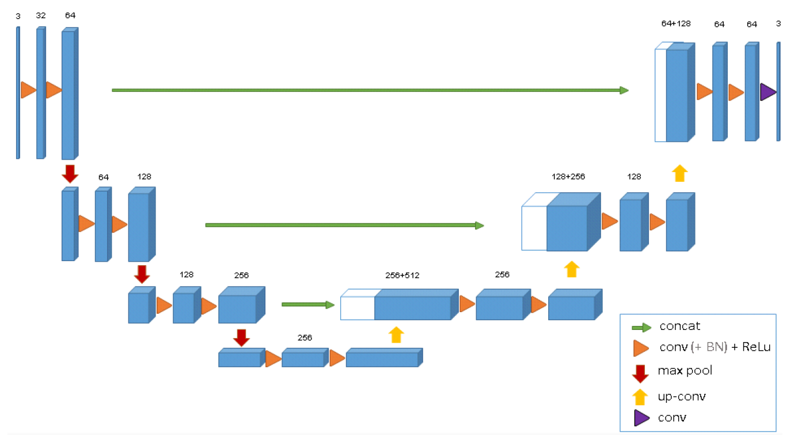
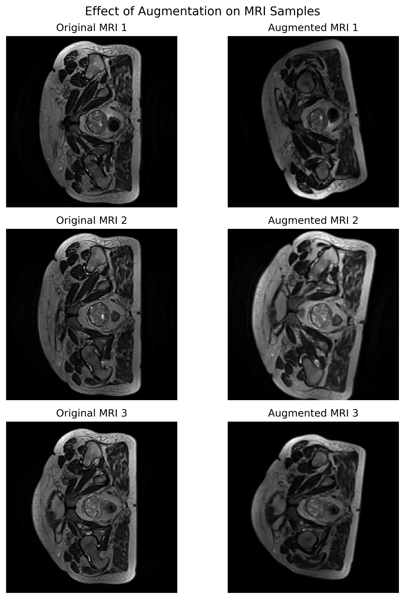
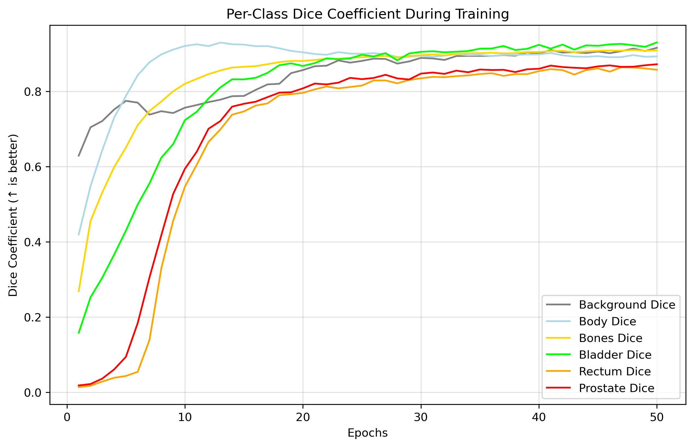

# 3D U-Net for Prostate MRI Segmentation
**Author:** Qilin He (s4801815)  
**Course:** COMP3710 – Pattern Analysis 2025  
**Project 7 -** Segment the (downsampled) Prostate 3D data set with the normal 3D U-Net  
**Date:** 23 October 2025  

---

## Project Overview
This project implements a **3D U-Net** architecture for volumetric segmentation of 3D prostate MRI from [CSIRO Data Access Portal - Labelled weekly MR images of the male pelvis](https://data.csiro.au/collection/csiro:51392v2?redirected=true). The MRI data has been pre-labeled with 6 regions – Background, Body, Bones, Bladder, Rectum, and Prostate. The goal of this project is to achieve **Dice Similarity coefficient ≥ 0.7** for all classes on the test set.  

## Model Architecture
The 3D U-Net model implemented in this project is based on the architecture suggested by Çiçek et al. (2016). The 3D U-Net architecture is proposed to solve the difficulties of segmenting volumetric biomedical data. To perform segmentation with the original 2D U-Net architecture, the volumetric data first need to be divided into 2D slices, where neighbouring slices would show almost no variation, and the 2D slices were processed and learnt independently in the 2D U-Net. Therefore, the annotation of large volume medical data with segmentation labels, in a slice-by-slice manner is very inefficient and does not generalise well (Çiçek et al, 2016).
<p align="center">
  
  <br><em>Figure 1: 3D U-Net Architecture</em>
</p>
Similar to the structure of the 2D U-Net, The 3D U-Net is also a convolutional autoencoder that replaces all the 2D operations with 3D convolutions, so the volumetric medical data can be processed by voxels instead of pixels of independent 2D slices. Figure 1 shows the architecture of the 3D U-Net suggested by Çiçek et al. (2016). In the contraction path, each level consists of two sets of a 3x3x3 convolution followed by a batch normalisation (BN) and a rectified linear unit (ReLu), then a max pooling layer of 2x2x2 with a stride of 2 to extract feature information and reduce the spatial resolution. Since the architecture is symmetric, the expansion path mirrors the structure of the contraction path. Each level starts with a 2x2x2 transpose convolution to recover the spatial resolution, followed by two sets of a 3x3x3 convolution, a BN and a ReLu. This helps to segment the locations of objects in the data. Additionally, each level has a skip path that concatenates the encoder with its corresponding decoder to pass the high-resolution spatial information that is lost through down-sampling. Finally, a 1x1x1 convolution is used to reduce the output channels to the number of labels - 3 in Figure 1. For this architecture, the weighted softmax loss function is used. It allows the network to train on sparse annotations. By setting the weight of unlabeled voxel to 0, the model can only learn from the labelled voxels to generalise the whole volume (Çiçek et al, 2016).  

## Data Loading and Preprocessing    
The MRI and label data are stored separately in the format of 3D Nifti files. The [Prostate 3D data set](https://data.csiro.au/collection/csiro:51392v2?redirected=true) consists of 211 3D MRI data for 38 patients, where each volume is 256x256x128 voxels. However, to prevent CUDA out-of-memory issues, the MRIs and labels have been cropped in to 128x128x64 voxels for each volume, which is only 1/8 of the original volume.
### Step 1 - File Retrieval and Sorting
[train.py](train.py)  
To retrieve and load the MRI and label data for either training or prediction, first specify the directories of the data. Then use the `glob` library to sort (so the labels and MRI match) and retrieve all the data. For example:
```
mri_dir   = "HipMRI_study_complete_release_v1/semantic_MRs_anon"
label_dir = "HipMRI_study_complete_release_v1/semantic_labels_anon"

mri_files = sorted(glob.glob(f"{mri_dir}/*.nii.gz"))
label_files = sorted(glob.glob(f"{label_dir}/*.nii.gz"))
```
### Step 2 - Training Data Augmentation
[train.py](train.py)  
Since the data set was already relatively small and had been cropped to prevent CUDA OOM issues, data augmentation is necessary to introduce variations into the input data to avoid overfitting. The following augmentation techniques were used:
- Random Flip (horizontal flip by a probability of 0.5)
- Random Affine (scale ±10%, rotate ±10°)
- Random Elastic Deformation (7 control points, ±7 voxels)
- Random Gamma (log_gamma=(-0.3, 0.3))
- Random Noise (mean = 0, std = 0.01, slight Gaussian noise)
- Z-Normalisation
These augmentation techniques also simulate variations that may occur when taking MRIs (e.g. patient movements, scanner noise, tissue warping). The effect of the augmentation is shown as the following:
<p align="center">
  
  <br><em>Figure 2: Effect of the Augmentation</em>
</p>

### Step 3 - Data Set Splitting
[train.py](train.py)  
To ensure the randomness and reproducibility in data set splitting, `torch.utils.data.random_split()` with a generator that used `seed = 233` is used. The data set is split into a training set, a validation set and a test set with the proportions of 0.7, 0.15 and 0.15, respectively. This ensures that the model has a sufficient amount of data for training, and that the evaluation of its performance on the validation and test sets is reliable. Additionally, the indices in which, the dataset has been split on is saved as `data_splits.pt`, so the test set alone can be reproduced in [predict.py](predict.py).

### Step 4 - Applying the Augmentation and Loading the Data
This step handles the preprocessing of loading of the MRI and label data.  
[dataset.py](dataset.py)  
- Defines the `MRIDataset` class that utilises the helper functions `to_channels()` and `load_data_3D()`
- `to_channels()` converts a 3D label array into one-hot encoded multi-channel array.
- `load_data_3D()` handles the loading of the 3D MRI and label data.
- The `MRIDataset` class also handles the data cropping and augmentation.  
  
[train.py](train.py)  
- Instantiate the split datasets.
- Wraps the datasets into `DataLoaders` objects with batching and shuffling.
  
## Model Definition
The actual model is implemented in [modules.py](modules.py), follows the architecture in Figure 1. However, a few adjustments are made:
- The **input channel is 1** and the **output channel is 6**, because the MRIs are greyscale and there are 6 segmentation labels.  
- The model was simplified to **three encoder layers** instead of four, and the **bottleneck has channel dimensions reduced from 512 to 256**. This design choice for reducing GPU memory usage, training time and overfitting, given the relatively small and cropped training set.

### The Structure
- `BasicConv3D` block consists of two sets of 3D convolution, 3D BN, ReLu and 3D drop out with the probability of 0.1.
- The `UNet 3D` class defines the general structure of the 3D U-Net model.
- Three encoder layers that increases feature channels from 1 -> 32 -> 64 -> 128, with 3D max-pooling of size 2.
- A bottleneck that expands feature channels from 128 to 256 through a basic block.
- Three decoder layers for upsamling (256 -> 128 -> 64 -> 32) with two 3D transpose convolutions and skip connections that concatenate encoder features with corresponding decoder features.
- Lastly, a convlution to map the output channels from 32 to 6 segmentation labels.

## Training
[train.py](train.py)
### Hyper-parameters
- Batch Size: 1
- Number of Epochs: 50, with early stopping based on validation loss i.e. if no changes for 10 epochs.
- Learning Rate: 1e<sup>-4</sup>

### Labels
The [Prostate 3D data set](https://data.csiro.au/collection/csiro:51392v2?redirected=true) labels MRI scans into the following labels:
| Label Number | Anatomical Region|
|:-------------|:-----------------|
|0| Background
|1| Body
|2| Bones
|3| Bladder
|4| Rectum
|5| Prostate

### Example Input and Output

| Stage | Description | Example Shape |
|:------|:-------------|:--------------|
| **Input (MRI volume)** | A 3D greyscale MRI -> 1 channel. Each voxel stores one intensity value. | `[Batch Size, Channel Number, Depth (z-axis), Height, Width]` -> e.g. `[1, 1, 64, 128, 128]` |
| **Output (logits)** | Output by the final 1x1x1 convolution. Each voxel has a 6-element logit vector. | shape of the output: `[B, 6, D, H, W]` -> e.g. `[1, 6, 64, 128, 128]`, example logit vector in a voxel: [-0.9, 1.2, 0.3, -0.5, 0.8, -2.0] |
| **Softmax probabilities** | Softmax is used to normalise the predicted label probabilities to sum up to 1 across the 6 channels for every voxel. | e.g. [-0.9, 1.2, 0.3, -0.5, 0.8, -2.0] ->  [0.06, 0.49, 0.13, 0.09, 0.22, 0.01]|
| **Predicted segmentation map** | Discrete class labels obtained using `torch.argmax`. Each voxel is assigned to one of six tissue classes. | [0.06, 0.49, 0.13, 0.09, 0.22, 0.01] -> 1 - Body |

---


### Loss Function
The Dice Coefficient (DSC) Loss is used as the loss function for the 3D U-Net model. It has the following formula:
$$
\mathcal{L}_{Dice} = 1 - \frac{2|P \cap G|}{|P| + |G|}
$$
The DSC Loss is useful when there exists imbalance between the training set and validation/test set (0.7 vs 0.15),  because it measures the region that is not overlapped (mismatch) between the predicted segmentation and ground-truth segmentation, normalised by their total size (Harisha, 2023).
### Optimiser
The Adaptive Momentum Estimation (Adam) optimiser is used for the 3D U-Net model. It combines the advantages of Momentum and RMSprop, making the convergence quicker and helps to overcome the problem of diminishing learning rates. Adam dynamically adjusts the learning rate for each parameter, therefore, it requires less manual tuning of hyper-parameters and makes the convergence more efficient and stable on small datasets (Geekforgeeks, 2025).

### Training Result
<p align="center">
  
  <br><em>Figure 3: Per Class Dice Coefficient During Training</em>
</p>
The results in Figure 3 are obtained by calculating the DSC (1 - DSC loss per class) for each label, between the training and validation sets. The DSC for all labels show rapid increases around epoch 15, which shows the effect of using the Adam optimser. Later on, the DSCs reach the plateau, suggesting the model has converged and reached the optimal performance. The 3D U-Net model does a good job with segmenting the voxels against the validation set with accuracies above 0.8 for all labels.

## Test Results
[predict.py](predict.py)  
The best model was trained in epoch 46 with a validation loss of 0.068. It is saved as `checkpoints/unet3d_best.pth`. It can be loaded using:
```
checkpoint = torch.load(checkpoint_path, map_location=device)
model.load_state_dict(checkpoint["model_state_dict"]) # Load the parameters
```


## Appendix/Reference
Çiçek, Ö., Abdulkadir, A., Lienkamp, S.S., Brox, T., Ronneberger, O. (2016). 3D U-Net: Learning Dense Volumetric Segmentation from Sparse Annotation. In: Ourselin, S., Joskowicz, L., Sabuncu, M., Unal, G., Wells, W. (eds) Medical Image Computing and Computer-Assisted Intervention – MICCAI 2016. MICCAI 2016. Lecture Notes in Computer Science(), vol 9901. Springer, Cham. https://doi.org/10.1007/978-3-319-46723-8_49

Dowling, J., Greer, P. (2021). Labelled weekly MR images of the male pelvis. v2. - CSIRO. Data Collection. https://doi.org/10.25919/45t8-p065

Geeksforgeeks. (2025). What is Adam Optimizer? - GeeksforGeeks. GeeksforGeeks. https://www.geeksforgeeks.org/deep-learning/adam-optimizer/

Harisha, L. (2023). Dice Coefficient! What is it? Medium. https://lathashreeh.medium.com/dice-coefficient-what-is-it-ff090ec97bda